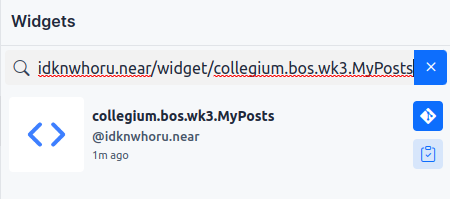
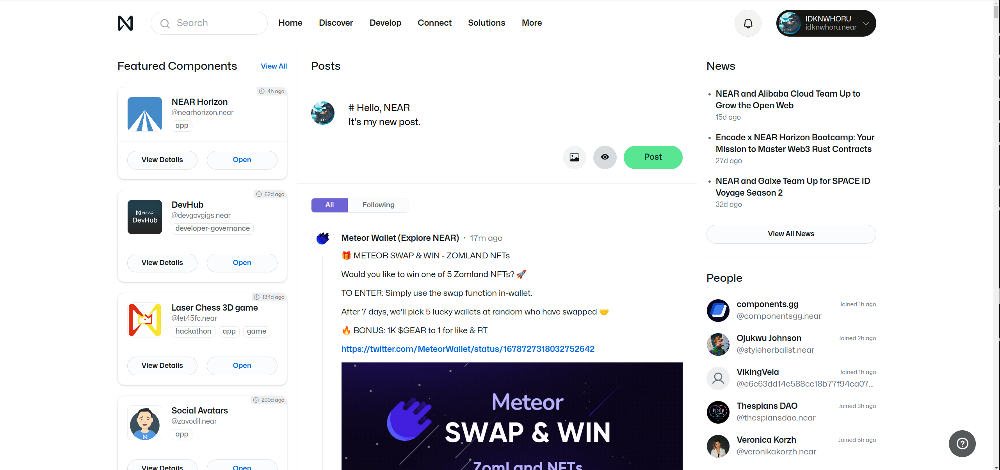
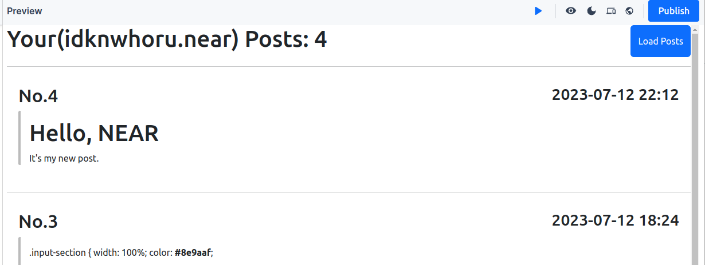
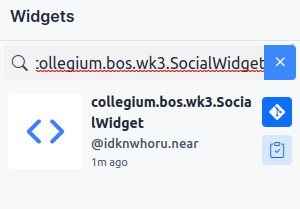
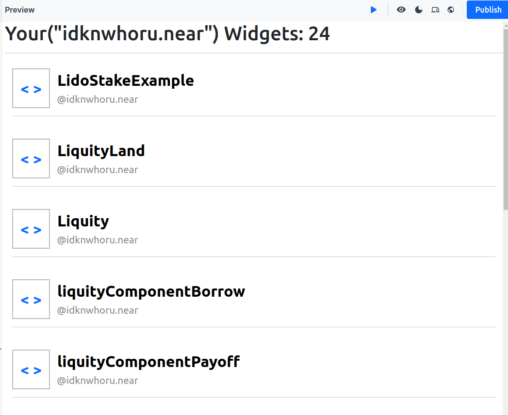

# Collegium-BOS-WK3

## 주제: 소셜 DB 컨트랙트에서 데이터를 가져오기

## 1. 온라인 에디터 환경 접속하기
1. [nearpad 편집기](https://nearpad.dev/editor) 사이트에 접속해주세요.

## 2. indexer를 이용하여 내 게시글 불러오기
1. `idknwhoru.near/widget/collegium.bos.wk3.MyPosts` 위젯을 fork 해주세요.

2. [near](https://near.org/) 페이지에 접속합니다
3. 새로운 Post를 작성합니다.

4. `Load Posts` 버튼을 클릭한 뒤, 새로운 포스트를 확인합니다.

## 3. Social DB를 이용하여 데이터 가져오기
1. `idknwhoru.near/widget/collegium.bos.wk3.SocialWidget` 위젯을 fork 해주세요.

2. 내가 만든 위젯 목록을 확인해주세요.
3. 아이콘, 위젯 제목, 작성자를 클릭해보세요.

## Mission
나만의 프로필 페이지를 만들어주세요.
- 요청 사항은 다음과 같습니다. 
    - [ ] 2개의 탭이 `['post', 'widget']` 있습니다.
    - [ ] post 탭을 누르면 내 계정으로 만든 post 목록을 표시합니다.
    - [ ] widget 탭을 누름녀 내 계정으로 만든 widget 목록을 표시합니다.